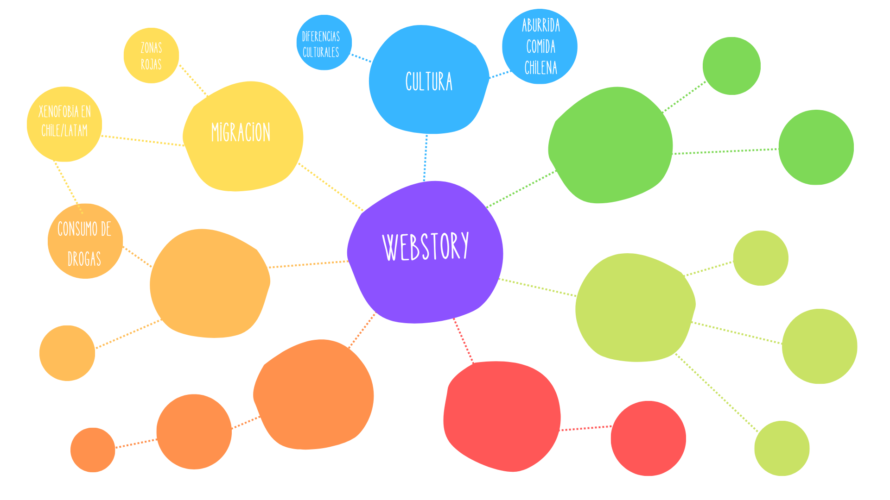

# Conclusiones Actividad

Durante la actividad en clases se realizó una lluvia de ideas respecto a lo que se trabajará durante el semestre. 

A continuación se adjuntan las principales ideas:

1. **Comparativa cultural entre Chile vs el resto de latinoamerica:** en este se abordó la posibilidad de centrarse en un tema especifico para comparar, por ejemplo comida, bailes, etc. 

*Sin embargo, hubo una inclinación por centrarse en centrarse en una investigación que abogue por encontrar las "extrañezas" de Chile que lo hacen especial, y a su vez, definir correctamente qué se entiende por "cultura latina" y por qué encajamos -o no- en ella.*

2. **Migración:** se abordó sobre la posibilidad de realizar la investigación sobre ciertas problematicas que han surgido en Chile tras la ola migratoria. Temas como la xenofobía que ha surgido con fuerza en el país o las zonas rojas de extranjeros.

En el siguiente mapa se puede ver el mapa mental realizado en base a las ideas: 

